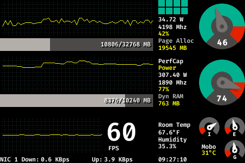
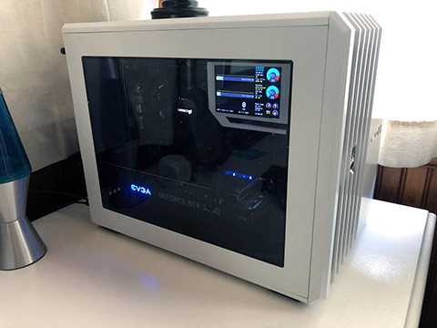

# Neuromancer Dash

Provides network connected, standalone monitoring of computer health data using AIDA64 LCD data streams. Neuromancer Dash supports multiple pages and can also pull data from other hardware such as temperature and humidity sensors.

Inspired by JayzTwoCents' external monitor panel: https://www.youtube.com/watch?v=RTdniu3gn3Y

# Hardware
Neuromancer Dash will run on anything with an external display that's capable of running pygame 2.0.0. For my dashboard I'm using a Raspberry Pi Zero W and 5" 480x320 HDMI LCD panel. The files required to customize and print your own mount are included in the **hardware_support** directory or can be found on Thingiverse: https://www.thingiverse.com/thing:4708587

# Host Installation
Install AIDA64 (required, I used AIDA64 Extreme)
Install RivaTunerStatisticsServer (optional if you want FPS data)

1. Open AIDA64 Extreme
2. File -> Preferences
3. Hardware Monitoring -> LCD -> Remote Sensor -> Enabled RemoteSensor LCD support
4. Hardware Monitoring -> LCD -> LCD Items -> Import, choose file in assets\aida64_layouts
5. Hardware Monitoring -> Update Frequency -> Change LCD to 100ms (or whatever you're comfortable with)
6. Open the port configured by AIDA64's RemoteSensor support in your firewall (default 8080)

# Raspberry Pi Client Installation
1. Clone this repository onto your client
2. Install Python3 components:
    * pip3 install sseclient
    * pip3 install pygame --upgrade
    * pip3 install Adafruit_DHT
3. Install required SDL2 components:
    * sudo apt-get install libsdl2-ttf-2.0-0 libsdl2-mixer-2.0-0 libsdl2-image-2.0-0
4. Update dash_launcher.sh to reflect the path you cloned this repository into as well as the network address information of your host.
5. (optional) Add dash_laucnher.sh to your crontab for automatic execution
    * sudo crontab -e
    * Add this line to the bottom of the file: **@reboot sh /home/pi/src/neuromancerdash/dash_launcher.sh &**

# Other Client Installation
Other client hardware can easily be used, clone the repo, install the Python3 components using whichever mechanisms work best for your client. Some systems may already have the SDL2 components in place after pygame is installed/updated, others may required building them from source. I used a Windows 10 PC for the bulk of development and it was easy-peesy.

# Execution
Two options:
1. Run **dash_launcher.sh**, this can be added to your crontab for automatic startup
2. Run **python3 neuromancerdash.py --aidasse http://example_ip:8080/sse**
